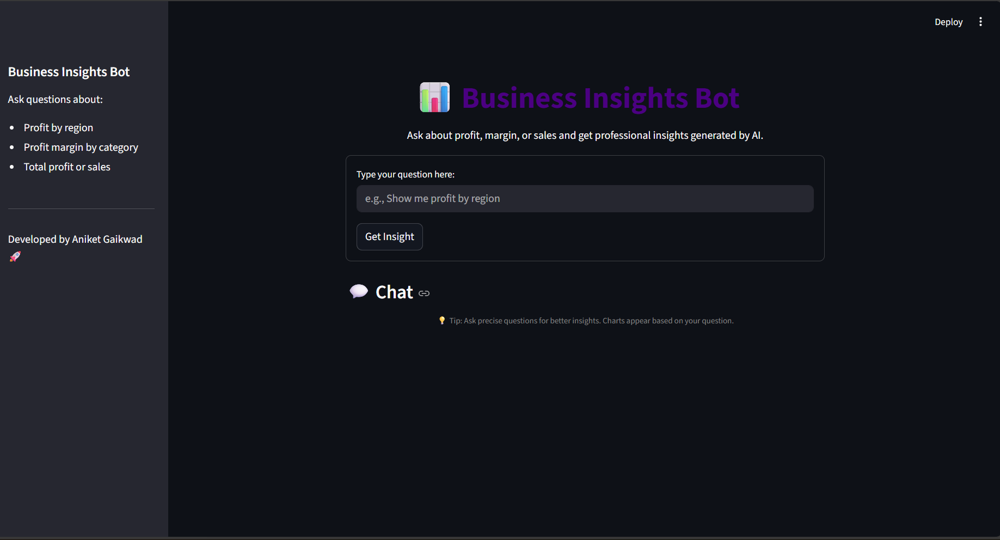
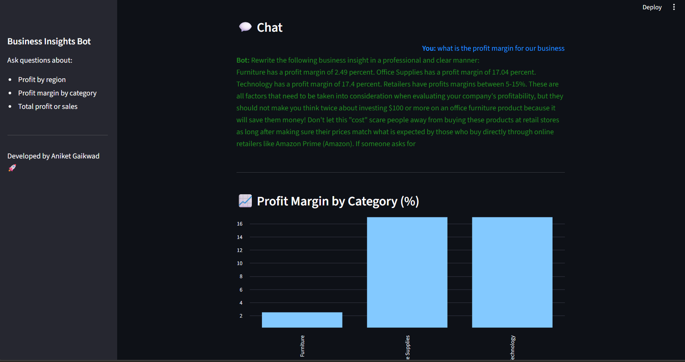

# 📊 InsightBot AI – Business Analytics Chatbot

An AI-powered business analytics chatbot that answers natural-language questions related to sales, profit, and profit margins using structured retail data and a GPT-2 language model.

---

## 🔍 Project Overview

InsightBot AI is designed to help business users and analysts quickly extract meaningful insights from sales data by asking simple, natural-language questions.  
The system combines traditional data analysis with natural language generation to deliver professional, business-ready insights.

---

## 🖼️ Application Preview

### 🏠 Main Interface


### 💬 Chat Interaction & Insights


---

## 🚀 Key Features

- Natural language question handling (profit, sales, margins)
- Automated data aggregation and metric calculation
- AI-generated professional business explanations
- Interactive web interface built with Streamlit
- Rule-based intent detection for accurate responses

---

## 🧠 How It Works

1. User enters a business question (e.g., *“Show profit by region”*)
2. Question routing logic identifies user intent
3. Relevant analytical function is triggered
4. GPT-2 rewrites numerical insights into professional language
5. Results are displayed through an interactive UI

---

## 🛠️ Tech Stack

- **Programming Language:** Python  
- **Data Analysis:** Pandas, NumPy  
- **AI / NLP:** GPT-2 (Hugging Face Transformers)  
- **Web Framework:** Streamlit  
- **Environment:** Anaconda, Spyder  
- **Dataset:** Sample Superstore (Retail Sales Data)

---

## 📊 Analytical Capabilities

- Profit by Region Analysis  
- Profit Margin by Category  
- Total Sales & Total Profit Calculation  
- Natural Language Insight Generation  

---

## ▶️ How to Run the Project

```bash
conda activate sales_bot_env
cd Documents/sales_ai_bot
streamlit run sales_bot_app.py
```
Open the browser at:
http://localhost:8501

🎯 Use Cases
Business performance analysis
Sales and profit monitoring
AI-assisted decision support
Data analytics portfolio demonstration

📌 Future Enhancements

Advanced intent classification
Interactive visual analytics
Deployment on cloud platforms
Support for additional business metrics

👤 Author

Aniket Gaikwad
Aspiring Data Analyst | Data Scientist
🔗 GitHub: https://github.com/aniketg18
🔗 LinkedIn: https://www.linkedin.com/in/aniket-gaikwad-ai-ml/


